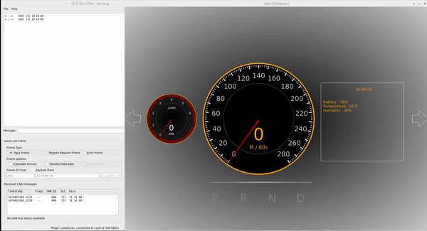

<div align="center">
  <a href="https://github.com/othneildrew/Best-README-Template">
    
  </a>
</div>

# Intro

Second project is making digital instrument cluster of ‘PiRacer’.

It’s easy to make digital instrument cluster by using arduino sensor, android studio.

But in SEA:ME we use CAN , IPC communication system, and QT to make digital instrument cluster.

### Arduino

A circuit board that can enables to get data from sensor.

There’s a variable types of Arduino (ex. arduino uno / arduino nao / arduino leonardo)

But I use Arduino Uno board.

I use Arduino speed sensor, temperature sensor, and make an simple program to get RPM, KM/H from the sensor.


↑  Arduino uno board　　　　　　　　　　　　　　　　　　　　　　　　　　　↑  Arduino uno board

### CAN


CAN = Wired communication.

You can **send** / **get** data.

By using can, the wiring of the vehicle can be greatly reduced. 

To use CAN, You have to extend physically Arduino CAN Shiled / Raspberry pi CAN Bus Shiled.

(Also you need to Install the software ‘CAN extension’ in your laptop.)

### D-Bus (IPC)


IPC = Wireless communication

IPC means Inter process communication. By using IPC, we can communicate each program.

for example when call comes from your friends while watching youtube, youtube program stopped.

That’s because call gives a message that stop media to youtube. That is IPC.

There’s lots of IPC.

But in this program. RPI is main computer. So I choose to use D-Bus IPC.

System Bus : Operated when computer is booted. OS or Daemon use messages from system bus

Session Bus : Operated when some program is booted. Session Bus can get message from System Bus, but there’s an limitations to send message from Session Bus to System Bus.

### QT

I have experience about ‘Android Studio’.

By using it, we can design Front-end of application. Also it enables to write code about Back-end.

The first impression of QT was like Android Studio.

With QT we can design our instrument cluster, and also connect data with other application.


↑ **Android Studio**

You can make frontend, backend In Android Studio


↑ **QT Creator**

Like Android Studio, you can make frontend, backend.

### Cross compile

Originally to run digital instrument cluster(made in QT) in RPI, we have to install QT in RPI. But by using Cross compile tech, we just make .exe file of QT, and send it to RPI. 

With Cross compile, we don’t have to install QT compiler in RPI. 

# Install the requirements

# PC

`Window` @[https://www.arduino.cc/en/software](https://www.arduino.cc/en/software)

`Linux` 

```jsx
sudo apt-get update
sudo apt-get install arduino arduino-core
```


### QT @[https://www.qt.io/download](https://www.qt.io/download)


### Vscode-ssh (optianal) / enables to edit RPI code in vscode

## Hardware setting


You also need to set some hardwares to  complete Project 2.

Belows are settings.

### Solder Raspberrypi CAN shield


If you use Raspberrypi CAN Shield, you need to solder GPIO 1 PIN

Solder it, and connect to 5V PIN

### Make Wheels for speed sensor

to check RPM, I use Arduino speed sensor. I Detached the cover of PI-Racer, and assembled wheels that i printed on main axis.

If RPM goes high, sensor’s flash can’t follow the change. So you need to reduce the holes of wheels.


The first version of wheel.

If the RPM goes high, on/off changes too fast to check RPM.

So in some degree, RPM goes to 0.

It’s not caused for Arduino code, but from hardware.

So, you have to reduce the hole number.


When it comes 4, no matter RPM goes high, we can catch RPM perfectly.

### Other 3D printing

To support speed sensor, RPI and board, I made several structure.


### Connect Wires

| ARDUINO | Speed SENSOR |
| --- | --- |
| 2 | D0 |
| GND | GND |
| VIN | VCC |

| ARDUINO | Tempertaure SENSOR |
| --- | --- |
| 3 | DATA |
| GND | GND |
| 5V | VCC |

| RPI CAN | ARDUINO CAN |
| --- | --- |
| 0_H | CAN-H |
| 0_L | CAN-L |

| RPI CAN | Pi racer board |
| --- | --- |
| SCL | SCL |
| GND | GND |
| SDA | SDA |
| 5V | 5V |
| GPIO1 | 3V3 |
| 5V | 5V |

## Software Setting

### 1. Install CAN

`Raspberry Pi`

1. Open Raspberry pi terminal (we can use Putty In our laptop to open it ).
    
    Type this.
    

```jsx
sudo nano /boot/config.txt
```

2. Add the following line at the end of config.txt file

```jsx
dtoverlay=seeed-can-fd-hat-v2
```

3. Reboot RPI using command

```jsx
sudo reboot
```

4. open terminal whe RPI rebooted, and type this.

Make sure that `Raspberrypi CAN extensionboard` is connected with your Raspberry pi.

```jsx
sudo ip link set can0 up type can bitrate 500000
sudo nano ~/.bashrc
```

- If there’s an error like this
    
    There’s CAN0 slot, CAN1 slot in Raspberrypi can shield.
    
    ```jsx
    (env) joe@joe:~ $ sudo ip link set can1 up type can bitrate 500000
    Cannot find device "can1"
    ```
    
    It means CAN 1 is not connected. Try CAN0 instead.
    

open bashrc, and add below line at the end of file

```jsx
alias cl='sudo ip link set can1 up type can bitrate 500000'
```

5. Install can utills

```jsx
sudo apt-get install can-utils
```

### Operate CAN

Below is a command to activate CAN in RPI.

You can type this command in any directory of RPI.

```jsx
sudo ip link set can1 up type can bitrate 500000
```

```jsx
candump can1
```

or

```jsx
sudo ip link set can0 up type can bitrate 500000
```

```jsx
candump can0
```

If RPI is connected with wire, you can get a message in terminal like this


You can also type

```jsx
sudo ip link set can0 down
```

or

```jsx
sudo ip link set can1 down
```

to shut down.

### 2. GUI in Raspberry pi

`Raspberry Pi`

(I use window OS in my laptop.)

1. Update & Reboot

```jsx
sudo apt update && sudo apt upgrade && sudo apt dist-upgrade && sudo reboot
```

2. Install Xorg

```jsx
sudo apt install xserver-xorg -y
```

3. Install Desktop Environment PIXEL

```jsx
sudo apt install raspberrypi-ui-mods -y
```

4. MATE

```jsx
sudo apt install mate-desktop-environment-core
```

5. KDE

```jsx
sudo apt install kde-plasma-desktop -y
```

6. LXDE

```jsx
sudo apt install lxde-core lxappearance -y
```

7. XFCE

```jsx
sudo apt install xfce4 xfce4-terminal -y
```

8. Install DIsplay Manage

```jsx
sudo apt install lightdm -y
```


choice `lightdm`

9. XDRP

```jsx
sudo apt-get install xrdp
```

10 . Update & Reboot

```jsx
sudo apt-get update
sudo reboot
```

`PC`

1. Open “remote desktop” in your window OS laptop
    
    
    
2. type your RPI IP address, then you can see RPI GUI. 
    
    
    

Now you can see RPI GUI in your laptop.


### 3. Cross Compile

`Raspberry Pi`

1. open RPI terminal, and type this.

```jsx
sudo nano /etc/apt/sources.list
```

2. delete # to activate this code

```jsx
deb-src http://raspbian.raspberrypi.org/raspbian/ buster main contrib non-free rpi
```

3. update and upgrade RPI

```jsx
sudo apt-get update
sudo apt-get dist-upgrade
sudo reboot
```

4. type this

```jsx
which rsync
sudo visudo
```

and add following line at the end of file

```jsx
**username** ALL=NOPASSWD:/usr/bin/rsync
```

so in my case

```jsx
joe ALL=NOPASSWD:/usr/bin/rsync
```

5. Install requirements for cross compile

```jsx
sudo apt-get build-dep qt5-qmake
```

```jsx
sudo apt-get build-dep libqt5gui5
```

```jsx
sudo apt-get build-dep libqt5webengine-data
```

```jsx
sudo apt-get build-dep libqt5webkit5
```

```jsx
sudo apt-get install libudev-dev libinput-dev libts-dev libxcb-xinerama0-dev libxcb-xinerama0 gdbserver
```

6. Create Directory for QT

```jsx
sudo mkdir /usr/local/qt5.15
sudo chown -R username:username /usr/local/qt5.15
```

so In my case

```jsx
sudo chown -R joe:joe /usr/local/qt5.15
```

`PC`

1. update your laptop & make directory for crosscompile

```jsx
sudo apt-get update
sudo apt-get upgrade
sudo apt-get install gcc git bison python gperf pkg-config gdb-multiarch
sudo apt install build-essential
sudo mkdir ~/rpi
sudo mkdir ~/rpi/build
sudo mkdir ~/rpi/tools
sudo mkdir ~/rpi/sysroot
sudo mkdir ~/rpi/sysroot/usr
sudo mkdir ~/rpi/sysroot/opt
sudo chown -R 1000:1000 ~/rpi
cd ~/rpi
```

2. Download Cross-Compiler to make .exe file run on Raspberry pi

```jsx
cd ~/rpi/tools
sudo wget https://releases.linaro.org/components/toolchain/binaries/7.4-2019.02/arm-linux-gnueabihf/gcc-linaro-7.4.1-2019.02-x86_64_arm-linux-gnueabihf.tar.xz
tar xfv gcc-linaro-7.4.1-2019.02-x86_64_arm-linux-gnueabihf.tar.xz
cd ~/rpi
```

### Sync PC with Raspberrypi

`PC`

```jsx
rsync -avz --rsync-path="sudo rsync" --delete username@RaspberrypiIP:/lib sysroot
rsync -avz --rsync-path="sudo rsync" --delete username@RaspberrypiIP:/usr/include sysroot/usr
rsync -avz --rsync-path="sudo rsync" --delete username@RaspberrypiIP:/usr/lib sysroot/usr
rsync -avz --rsync-path="sudo rsync" --delete username@RaspberrypiIP:/opt/vc sysroot/opt
rsync -avz --rsync-path="sudo rsync" qt5.15 username@RaspberrypiIP:/usr/local
```

So in my case

```jsx
rsync -avz --rsync-path="sudo rsync" --delete joe@192.168.0.107:/lib sysroot
rsync -avz --rsync-path="sudo rsync" --delete joe@192.168.0.107:/usr/include sysroot/usr
rsync -avz --rsync-path="sudo rsync" --delete joe@192.168.0.107:/usr/lib sysroot/usr
rsync -avz --rsync-path="sudo rsync" --delete joe@192.168.0.107:/opt/vc sysroot/opt
rsync -avz --rsync-path="sudo rsync" qt5.15 joe@192.168.0.107:/usr/local
```

### Make crosscompiled.exe file in your laptop

`PC`

Open a terminal in a directory which you want to make .exe file

In my case, I use example code of qt ‘collidingmice’

1. make .exe file 

```jsx
~/rpi/qt5.15/bin/qmake
make
```

then colidingmice.exe file will made in your ‘colidingmice’ directory

2. open terminal in ‘collidingmice’ directory and send .exe file to your RPI (wireless)

```jsx
scp **filename** **RPIusername**@**RPI_IPaddress**:/home/**RPIusername**
# for example collidingmice joe@10.12.249.12:/home/joe
```

### Execute cross compiled file

`Raspberry pi`

1. connect with GUI
2. Go to a directory where you send exe file
3. Click to excute
