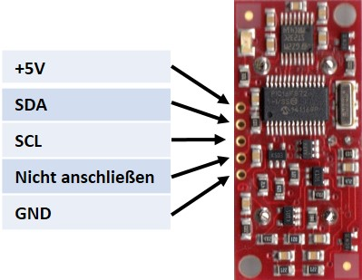

<div align="center">
  <a href="https://github.com/othneildrew/Best-README-Template">
    
  </a>
</div>
<br><br><br>

# Project 4


I got SRF 08 ultra sonic sensor.

Unfortunately, there’s no guideline about SRF08, But I guess there would no difference between SRF and other ultrasonic sensor.

So I started just connect this sensor to Rpi, and operate that.

I can find that SRF08 uses SDA/SCL to send / recive data from raspberrypi

Below is pinmap

<br><br><br><br>

<div  align="center">
 
</div>
<br>


<div  align="center">
Connect like this
<br><br>

| SRF08 | Raspberrypi |
| --- | --- |
| 5V | 5V PWR |
| SDA | GPIO2 |
| SCL | GPIO3 |
| Nicht anschlieben | X |
| GND | GND |


※ SDA / SCL can be Digital pin in Arduino<br>
※ You might need to solder SRF-08<br>
</div>
<br>


# Code

To operate SRF-08

```
#include <iostream>
#include <cstdlib>
#include <linux/i2c-dev.h>
#include <fcntl.h>
#include <cstring>
#include <sys/ioctl.h>
#include <sys/types.h>
#include <sys/stat.h>
#include <unistd.h>
#include <ctime>

using namespace std;

void Mysleep(int a)
{
    clock_t start_clk = clock();
    
    a--;
    while(1) {
        if ((clock() - start_clk) / CLOCKS_PER_SEC > a) break;
        }

}

int main(int argc, char **argv)
{
    cout <<"초음파 센서 프로그램 가동" << endl;    
    
    while(1){
    
    int address = 0x70;
    unsigned char buf[10];
    int fd = open("/dev/i2c-1", O_RDWR); // O_RDWR = open for reading and writing
    ioctl(fd, I2C_SLAVE, address);
        
    buf[0] = 0;
    buf[1] = 81;
    
    write(fd, buf, 2);
    
    usleep(750000);
    
    write(fd, buf, 1);
    
    read(fd, buf, 4);
    
    
    buf[0] = 0;
    
    unsigned char highByte = buf[2];
    unsigned char lowByte = buf[3];
    unsigned int result = (highByte <<8) + lowByte;			// Calculate range
    cout <<"Range was: " << result << endl;
    
    
    	Mysleep(0.1);
    }

}
```
<details>
  <summary>
How to compile, operate (in Linux)</summary>
<div markdown="1">
    
    1. make this sonic.cpp file using something like "VIM"
    
    2. Type "g++ mysonic.cpp -o sonic" to compile 
    
    3. Type "./sonic" to operate

  </details>
<br>

# OPEN CV

If your camera doesn't work in QT, consider to install Open CV

Open CV is a necessary program to process media file from camera.

we already installed Open CV in project 1, but that’s for python.

We need to install C++ Open CV to run QT in raspberry pi

You can also refer this to install OpenCV, or follow my guide.

[Raspberry Pi 4에 OpenCV 4.6.0 설치하는 방법](https://webnautes.tistory.com/916)

<details>
  <summary>Install guide</summary>
  <div markdown="1">

`raspberrypi4`

1. Check if OpenCV is already installed

```jsx
pkg-config --modversion opencv
```

If not installed, output must be like

```jsx
Package opencv was not found in the pkg-config search path.

Perhaps you should add the directory containing `opencv.pc'

to the PKG_CONFIG_PATH environment variable

No package 'opencv' found
```

If it was already installed, output must be like

```jsx
2.4.9.1
```

You can uninstall OpenCv package if you like

```jsx
sudo apt-get purge  libopencv* python-opencv
sudo apt-get autoremove
```

2. Preprocessing for install OpenCV

```jsx
sudo apt update
sudo apt upgrade
sudo reboot
```

3. Install requirements for OpenCV

```jsx
sudo apt install build-essential cmake
sudo apt install libjpeg-dev libtiff5-dev libjasper-dev libpng-dev
sudo apt install libavcodec-dev libavformat-dev libswscale-dev libxvidcore-dev libx264-dev libxine2-dev
sudo apt install libv4l-dev v4l-utils
sudo apt install libgstreamer1.0-dev libgstreamer-plugins-base1.0-dev gstreamer1.0-plugins-good gstreamer1.0-plugins-bad gstreamer1.0-plugins-ugly
sudo apt install libgtk-3-dev
sudo apt install libatlas-base-dev gfortran libeigen3-dev
sudo apt install python3-dev python3-numpy
```

4. Install OpenCV

```jsx
cd ~
mkdir opencv
cd opencv
wget -O opencv.zip https://github.com/opencv/opencv/archive/4.6.0.zip
unzip opencv.zip
wget -O opencv_contrib.zip https://github.com/opencv/opencv_contrib/archive/4.6.0.zip
unzip opencv_contrib.zip
rm opencv.zip
rm opencv_contrib.zip
cd opencv-4.6.0
mkdir build
cd build
```

You need to check your python library path

`input`

```jsx
python3 -m site
```

`output`

```jsx
/home/joe/env/lib/python3.7/site.py:165: DeprecationWarning: 'U' mode is deprecated
  f = open(fullname, "rU")
sys.path = [
    '/home/joe/opencv/opencv-4.6.0/build',
    '/home/joe/env/lib/python37.zip',
    '/home/joe/env/lib/python3.7',
    '/home/joe/env/lib/python3.7/lib-dynload',
    '/usr/lib/python3.7',
    '/home/joe/env/lib/python3.7/site-packages',
    '/home/joe/projects/donkeycar',
    **'/usr/local/lib/python3.7/dist-packages',**
    '/usr/local/lib/python3.7/dist-packages/pidisplay-0.0.0-py3.7.egg',
    '/usr/local/lib/python3.7/dist-packages/Adafruit_SSD1306-1.6.2-py3.7.egg',
    '/usr/local/lib/python3.7/dist-packages/Adafruit_GPIO-1.0.4-py3.7.egg',
    '/usr/local/lib/python3.7/dist-packages/Adafruit_PureIO-1.1.9-py3.7.egg',
    '/usr/lib/python3/dist-packages',
    '/usr/local/lib/python3.7/dist-packages/pidisplay-0.0.0-py3.7.egg',
    '/usr/local/lib/python3.7/dist-packages/Adafruit_SSD1306-1.6.2-py3.7.egg',
    '/usr/local/lib/python3.7/dist-packages/Adafruit_GPIO-1.0.4-py3.7.egg',
    '/usr/local/lib/python3.7/dist-packages/Adafruit_PureIO-1.1.9-py3.7.egg',
]
```

Red line is the path

Replace the path, OpenCV version, and install

```jsx
cmake -D CMAKE_BUILD_TYPE=RELEASE -D CMAKE_INSTALL_PREFIX=/usr/local -D WITH_TBB=OFF -D WITH_IPP=OFF -D WITH_1394=OFF -D BUILD_WITH_DEBUG_INFO=OFF -D BUILD_DOCS=OFF -D INSTALL_C_EXAMPLES=ON -D INSTALL_PYTHON_EXAMPLES=ON -D BUILD_EXAMPLES=OFF -D BUILD_TESTS=OFF -D BUILD_PERF_TESTS=OFF -D ENABLE_NEON=ON -D ENABLE_VFPV3=ON -D WITH_QT=OFF -D WITH_GTK=ON -D WITH_OPENGL=ON -D OPENCV_ENABLE_NONFREE=ON -D OPENCV_EXTRA_MODULES_PATH=../../opencv_contrib-4.6.0/modules -D WITH_V4L=ON -D WITH_FFMPEG=ON -D WITH_XINE=ON -D ENABLE_PRECOMPILED_HEADERS=OFF -D BUILD_NEW_PYTHON_SUPPORT=ON -D OPENCV_GENERATE_PKGCONFIG=ON -D PYTHON3_PACKAGES_PATH=/usr/local/lib/python3.7/dist-packages ../
```

5. Extend swap size

```jsx
sudo /etc/init.d/dphys-swapfile restart
```

change CONF_SWAPSIZE=100 to 2048

6. Compile

```jsx
time make -j4
```

7. Install

```jsx
sudo make install
sudo ldconfig
```

8. swap again to 100

```jsx
sudo nano /etc/dphys-swapfile

# set size to absolute value, leaving empty (default) then uses computed value

#   you most likely don't want this, unless you have an special disk situation

CONF_SWAPSIZE=100
```

9. Check installation

It can’t run in terminal

So open GUI in your raspberrypi4, and type the below code.

```jsx
cp  /usr/local/share/opencv4/samples/cpp/videocapture_basic.cpp
```

```jsx
g++ -o videocapture_basic videocapture_basic.cpp $(pkg-config opencv4 --libs --cflags)
```
</details>
<br>
<br>
Error
<details>
  <summary>Error message</summary>
  <div markdown="1">
seame-fablab@seamefablab-Precision-7550:~/Desktop/QTultra$ make
/home/seame-fablab/rpi/qt5.15/bin/uic ultrasonic.ui -o ui_ultrasonic.h
/home/seame-fablab/rpi/tools/gcc-linaro-7.4.1-2019.02-x86_64_arm-linux-gnueabihf/bin/arm-linux-gnueabihf-g++ -c -march=armv8-a -mtune=cortex-a72 -mfpu=crypto-neon-fp-armv8 -mfloat-abi=hard --sysroot=/home/seame-fablab/rpi/sysroot -O2 -std=gnu++1z -Wall -Wextra -D_REENTRANT -fPIC -DQT_NO_DEBUG -DQT_WIDGETS_LIB -DQT_GUI_LIB -DQT_CORE_LIB -I. -I../../rpi/qt5.15/include -I../../rpi/qt5.15/include/QtWidgets -I../../rpi/qt5.15/include/QtGui -I../../rpi/qt5.15/include/QtCore -I. -I. -I../../rpi/qt5.15/mkspecs/devices/linux-rasp-pi4-v3d-g++ -o main.o main.cpp
/home/seame-fablab/rpi/tools/gcc-linaro-7.4.1-2019.02-x86_64_arm-linux-gnueabihf/bin/arm-linux-gnueabihf-g++ -c -march=armv8-a -mtune=cortex-a72 -mfpu=crypto-neon-fp-armv8 -mfloat-abi=hard --sysroot=/home/seame-fablab/rpi/sysroot -O2 -std=gnu++1z -Wall -Wextra -D_REENTRANT -fPIC -DQT_NO_DEBUG -DQT_WIDGETS_LIB -DQT_GUI_LIB -DQT_CORE_LIB -I. -I../../rpi/qt5.15/include -I../../rpi/qt5.15/include/QtWidgets -I../../rpi/qt5.15/include/QtGui -I../../rpi/qt5.15/include/QtCore -I. -I. -I../../rpi/qt5.15/mkspecs/devices/linux-rasp-pi4-v3d-g++ -o ultrasonic.o ultrasonic.cpp
/home/seame-fablab/rpi/tools/gcc-linaro-7.4.1-2019.02-x86_64_arm-linux-gnueabihf/bin/arm-linux-gnueabihf-g++ -march=armv8-a -mtune=cortex-a72 -mfpu=crypto-neon-fp-armv8 -mfloat-abi=hard --sysroot=/home/seame-fablab/rpi/sysroot -O2 -std=gnu++1z -Wall -Wextra -dM -E -o moc_predefs.h ../../rpi/qt5.15/mkspecs/features/data/dummy.cpp
/home/seame-fablab/rpi/qt5.15/bin/moc -DQT_NO_DEBUG -DQT_WIDGETS_LIB -DQT_GUI_LIB -DQT_CORE_LIB --include /home/seame-fablab/Desktop/QTultra/moc_predefs.h -I/home/seame-fablab/rpi/qt5.15/mkspecs/devices/linux-rasp-pi4-v3d-g++ -I/home/seame-fablab/Desktop/QTultra -I/home/seame-fablab/rpi/qt5.15/include -I/home/seame-fablab/rpi/qt5.15/include/QtWidgets -I/home/seame-fablab/rpi/qt5.15/include/QtGui -I/home/seame-fablab/rpi/qt5.15/include/QtCore -I/home/seame-fablab/rpi/tools/gcc-linaro-7.4.1-2019.02-x86_64_arm-linux-gnueabihf/arm-linux-gnueabihf/include/c++/7.4.1 -I/home/seame-fablab/rpi/tools/gcc-linaro-7.4.1-2019.02-x86_64_arm-linux-gnueabihf/arm-linux-gnueabihf/include/c++/7.4.1/arm-linux-gnueabihf -I/home/seame-fablab/rpi/tools/gcc-linaro-7.4.1-2019.02-x86_64_arm-linux-gnueabihf/arm-linux-gnueabihf/include/c++/7.4.1/backward -I/home/seame-fablab/rpi/tools/gcc-linaro-7.4.1-2019.02-x86_64_arm-linux-gnueabihf/lib/gcc/arm-linux-gnueabihf/7.4.1/include -I/home/seame-fablab/rpi/tools/gcc-linaro-7.4.1-2019.02-x86_64_arm-linux-gnueabihf/lib/gcc/arm-linux-gnueabihf/7.4.1/include-fixed -I/home/seame-fablab/rpi/tools/gcc-linaro-7.4.1-2019.02-x86_64_arm-linux-gnueabihf/arm-linux-gnueabihf/include -I/home/seame-fablab/rpi/sysroot/usr/include/arm-linux-gnueabihf -I/home/seame-fablab/rpi/sysroot/usr/include ultrasonic.h -o moc_ultrasonic.cpp
/home/seame-fablab/rpi/tools/gcc-linaro-7.4.1-2019.02-x86_64_arm-linux-gnueabihf/bin/arm-linux-gnueabihf-g++ -c -march=armv8-a -mtune=cortex-a72 -mfpu=crypto-neon-fp-armv8 -mfloat-abi=hard --sysroot=/home/seame-fablab/rpi/sysroot -O2 -std=gnu++1z -Wall -Wextra -D_REENTRANT -fPIC -DQT_NO_DEBUG -DQT_WIDGETS_LIB -DQT_GUI_LIB -DQT_CORE_LIB -I. -I../../rpi/qt5.15/include -I../../rpi/qt5.15/include/QtWidgets -I../../rpi/qt5.15/include/QtGui -I../../rpi/qt5.15/include/QtCore -I. -I. -I../../rpi/qt5.15/mkspecs/devices/linux-rasp-pi4-v3d-g++ -o moc_ultrasonic.o moc_ultrasonic.cpp
/home/seame-fablab/rpi/tools/gcc-linaro-7.4.1-2019.02-x86_64_arm-linux-gnueabihf/bin/arm-linux-gnueabihf-g++ -mfloat-abi=hard --sysroot=/home/seame-fablab/rpi/sysroot -Wl,-O1 -Wl,-rpath,/usr/local/qt5.15/lib -Wl,-rpath-link,/home/seame-fablab/rpi/sysroot/usr/lib/arm-linux-gnueabihf -Wl,-rpath-link,/home/seame-fablab/rpi/sysroot/lib/arm-linux-gnueabihf -o QTultra main.o ultrasonic.o moc_ultrasonic.o   /home/seame-fablab/rpi/qt5.15/lib/libQt5Widgets.so /home/seame-fablab/rpi/qt5.15/lib/libQt5Gui.so /home/seame-fablab/rpi/qt5.15/lib/libQt5Core.so -L/home/seame-fablab/rpi/sysroot/usr/lib/arm-linux-gnueabihf -lGLESv2 -lpthread   
/home/seame-fablab/rpi/sysroot/usr/lib/arm-linux-gnueabihf/libpthread.a(unwind.o): In function `unwind_stop':
/build/glibc-Ir6W4B/glibc-2.28/nptl/unwind.c:72: undefined reference to `__pointer_chk_guard_local'
collect2: error: ld returned 1 exit status
make: *** [Makefile:268: QTultra] Error 1
</details>
<br>

solution:

```jsx
~/rpi/sysroot/usr/lib/arm-linux-gnueabihf$  sudo ln -sf libpthread.so.0 libpthread.so
```